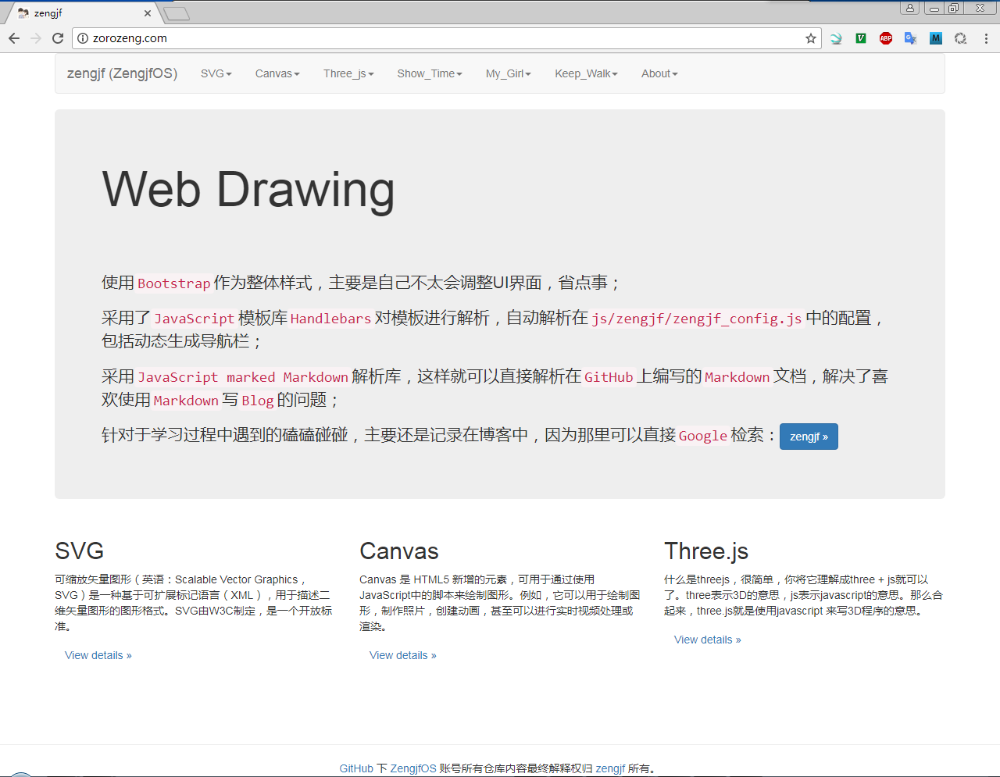

# WebDrawingDemo

学习使用SVG、Canvas、Three.js进行绘图

## Home Page

## 辅助工具

* [SVG Online Editor](https://c.runoob.com/more/svgeditor/)
* [bootstrap Layout Editor](http://www.runoob.com/try/bootstrap/layoutit/)
* [bootstrap Layout Editor: bootply](https://www.bootply.com/new?visual=1)

## 辅助插件

* [CSS Library: Bootstrap](http://getbootstrap.com/)
* [JavaScript Template Library: Handlebars](http://handlebarsjs.com/)
* [Markdown JavaScript Library: marked](https://github.com/chjj/marked)
* [Syntax highlighting for the Web: highlight.js](https://highlightjs.org/)

## 参考资料

### SVG 参考资料

* [Oxxo Studio](http://www.oxxostudio.tw/list.html)
* [SVG 研究之路 (3) - 基本形狀](http://www.oxxostudio.tw/articles/201406/svg-03-basic-shapes.html)

### Canvas 参考资料

### Three.js 参考资料

### 其他资料
* [Game Development Tutorials](http://www.lessmilk.com/)
