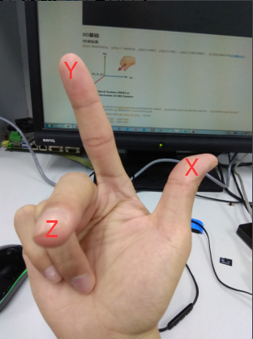
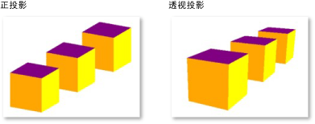
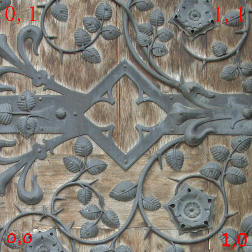

# Base Knowledge Learning

## 一、参考文档

[Threejs基础教程](http://www.hewebgl.com/article/articledir/1)

## 二、坐标轴

**右手坐标系**，这个需要注意的就是实际看到的坐标轴，要注意和`Camera`的位置有关系。可以将`Camera`当做我们的眼睛。



## 三、相机

* **正投影相机**: `THREE.OrthographicCamera`，机械制图里面经常用的；
* **透视投影相机**: `THREE.PerspectiveCamera`，现实生活中，人的眼睛是这种视图。



## 四、视角

可以看成是人的瞳孔聚焦的范围，如果我们聚焦在一个点上看的时候，这个视角是属于很小的，如果我们在山顶上，想看全景图的那种，视角范围就变大了，视角个人理解可以认为是视觉范围。

## 五、光源

### 5.1 光源类型

* 环境光： 环境光是经过多次反射而来的光称为环境光，无法确定其最初的方向。环境光是一种无处不在的光。环境光源放出的光线被认为来自任何方向。
* 点光源：由这种光源放出的光线来自同一点，且方向辐射自四面八方。例如蜡烛放出的光，萤火虫放出的光。
* 聚光灯：这种光源的光线从一个锥体中射出，在被照射的物体上产生聚光的效果。使用这种光源需要指定光的射出方向以及锥体的顶角α。手电筒。
* 方向光（平行光）：平行光又称为方向光（Directional Light），是一组没有衰减的平行的光线，类似太阳光的效果。

### 5.2 材质与光源的关系

材质就是材料和质感的完美结合。

在渲染程序中，它是表面各可视属性的结合，这些可视属性是指表面的色彩、纹理、光滑度、透明度、反射率、折射率、发光度等。正是有了这些属性，才能让我们识别三维中的模型是什么做成的，也正是有了这些属性，我们计算机三维的虚拟世界才会和真实世界一样缤纷多彩。　

材质的真相到底是什么呢？仍然是光，离开光材质是无法体现的。举例来说，借助夜晚微弱的天空光，我们往往很难分辨物体的材质，因为他们很多都表现出黑色，我们难以区分是铝合金，还是塑料的。而在正常的照明条件下，则很容易分辨。另外，在彩色光源的照射下，我们也很难分辨物体表面的颜色，在白色光源的照射下则很容易。这种情况表明了物体的材质与光的微妙关系。

最常见的材质之一就是Lambert材质，这是在灰暗的或不光滑的表面产生均匀散射而形成的材质类型。比如一张纸就是Lambert表面。 首先它粗糙不均匀，不会产生镜面效果。我们在阅读书籍的时候，没有发现书上一处亮，一处不亮吧，它非常均匀，这就是兰伯特材质。

环境光就是在场景中无处不在的光，它对物体的影响是均匀的，也就是无论你从物体的那个角度观察，物体的颜色都是一样的，这就是伟大的环境光。你可以把环境光放在任何一个位置，它的光线是不会衰减的，是永恒的某个强度的一种光源。

## 六、纹理

纹理对于我们来说是多么的重要，以至于大家已经忘记了它的重要性。闭上眼睛想一想，如果你心爱的女人，没有穿衣服，该是多么的令你心动啊。哦，说错了，是她不仅没有穿衣服，而且没有皮肤，就像画皮中的没有皮的周迅一样，你就不会喜欢它了，因为她奇丑无比。

纹理之于3D世界，就像皮肤之于动物世界一样。如果没有皮肤，那么人就会非常的丑陋，没有纹理，那么3D世界也就不会那么吸引人了。

### 6.1 纹理图片

* 3D世界的纹理，由什么组成呢？3D世界的纹理由图片组成。
* THREE.Texture( image, mapping, wrapS, wrapT, magFilter, minFilter, format, type, anisotropy )
  * Image：这是一个图片类型，基本上它有ImageUtils来加载，如下代码：  
    var image = THREE.ImageUtils.loadTexture(url); // url 是一个http://xxxx/aaa.jpg 的类似地址，javascript没有从本地加载数据的能力，所以没有办法从您电脑的C盘加载数据。
  * Mapping：是一个THREE.UVMapping()类型，它表示的是纹理坐标。下一节，我们将说说纹理坐标。
  * wrapS：表示x轴的纹理的回环方式，就是当纹理的宽度小于需要贴图的平面的宽度的时候，平面剩下的部分应该p以何种方式贴图的问题。
  * wrapT：表示y轴的纹理回环方式。 magFilter和minFilter表示过滤的方式，这是OpenGL的基本概念，我将在下面讲一下，目前你不用担心它的使用。当您不设置的时候，它会取默认值，所以，我们这里暂时不理睬他。
  * format：表示加载的图片的格式，这个参数可以取值THREE.RGBAFormat，RGBFormat等。THREE.RGBAFormat表示每个像素点要使用四个分量表示，分别是红、绿、蓝、透明来表示。RGBFormat则不使用透明，也就是说纹理不会有透明的效果。
  * type：表示存储纹理的内存的每一个字节的格式，是有符号，还是没有符号，是整形，还是浮点型。不过这里默认是无符号型（THREE.UnsignedByteType）。暂时就解释到这里，有需要时，我们在仔细分析，或者给作者留言询问。
  * anisotropy：各向异性过滤。使用各向异性过滤能够使纹理的效果更好，但是会消耗更多的内存、CPU、GPU时间，暂时就了解到这里吧。

### 6.2 纹理坐标

* 在正常的情况下，你在0.0到1.0的范围内指定纹理坐标。  
  
* **Picture Demo Code：**
  ```
      // A begin
      var geometry = new THREE.PlaneGeometry( 500, 300, 1, 1 );
      geometry.vertices[0].uv = new THREE.Vector2(0,0);
      geometry.vertices[1].uv = new THREE.Vector2(2,0);
      geometry.vertices[2].uv = new THREE.Vector2(2,2);
      geometry.vertices[3].uv = new THREE.Vector2(0,2);
      // A end
      // B begin
      // 纹理坐标怎么弄
      var texture = THREE.ImageUtils.loadTexture("textures/a.jpg",null,function(t)
      {
      });
      var material = new THREE.MeshBasicMaterial({map:texture});
      var mesh = new THREE.Mesh( geometry,material );
      scene.add( mesh );
      // B end 
  ```
  * 画一个平面；
  * 为平面赋予纹理坐标；
  * 加载纹理；
  * 将纹理应用于材质。
* **Canvas Demo Code：**
  ```
      var geometry = new THREE.CubeGeometry(150, 150, 150);
      texture = new THREE.Texture( canvas);   // canvas是一个Canvas对象
      var material = new THREE.MeshBasicMaterial({map:texture});
      texture.needsUpdate = true;             // texture.needsUpdate设置为了true，如果不设置为true，那么纹理就不会更新，很可能你看到的是一个黑色的正方体，原因是纹理没有被载入之前，就开始渲染了，而渲染使用了默认的材质颜色。
      mesh = new THREE.Mesh( geometry,material );
      scene.add( mesh );
  ```

## 3D模型加载、使用

实现了vtkload加载vtk模型的功能：  
```
    var material = new THREE.MeshLambertMaterial( { color:0xffffff, side: THREE.DoubleSide } );
    var loader = new THREE.VTKLoader();
    loader.addEventListener( 'load', function ( event ) {
        var geometry = event.content;
        var mesh = new THREE.Mesh( geometry, material );
        mesh.position.setY( - 0.09 );
        scene.add( mesh );
    } );
    loader.load( "models/vtk/bunny.vtk" );  
```
